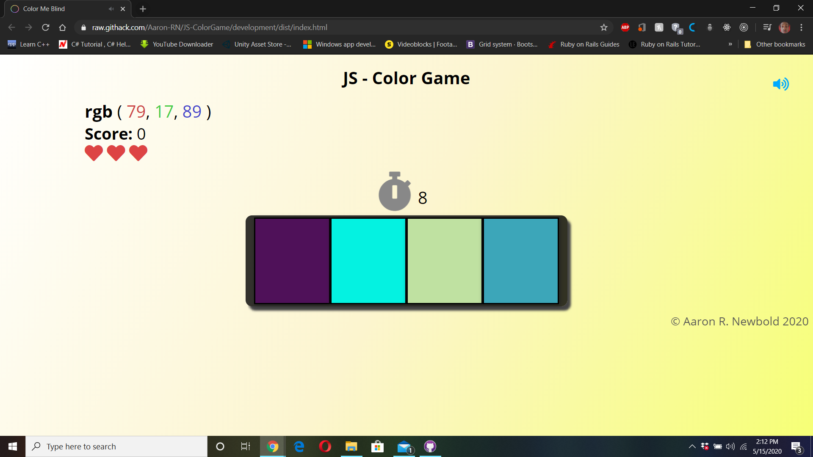

# JS-ColorGame
Can you guess which color corresponds to the shown RGB and Hex code?

## [Live DEMO](https://raw.githack.com/Aaron-RN/JS-ColorGame/development/dist/index.html)

## Dependencies

- Axios
- Cors
- Express
- Mongoose
- Dotenv

## Built With

- HTML, CSS
- [JavaScript](https://developer.mozilla.org/en-US/docs/Web/JavaScript)
- [Node Package Manager(NPM)](https://www.npmjs.com/)
- [Node.js](https://www.nodejs.org/)
- [MongoDB](https://www.mongodb.com/)

## Author

👤 **Aaron Rory**

- Github: [@Aaron-RN](https://github.com/Aaron-RN)
- Twitter: [@ARNewbold](https://twitter.com/ARNewbold)
- Linkedin: [Aaron Newbold](https://www.linkedin.com/in/aaron-newbold-1b9233187/)

## 🤝 Contributing

Contributions, issues and feature requests are welcome!

Feel free to check the [issues page](issues/).

## Show your support

Give a ⭐️ if you like this project!

## 📝 License

This project is [MIT](lic.url) licensed.
